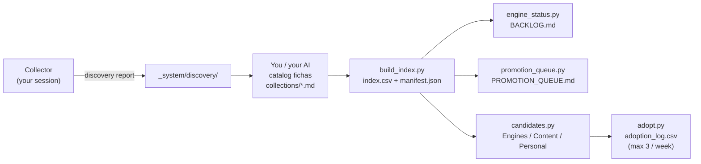

# Nexus Input Engine

[](LICENSE)


Turn saved social content into a prioritized feed of reusable ideas, routed to *your* projects.

Nexus Input Engine is a small, file-based pipeline. You (or your AI) collect items you saved on a
platform (Instagram, X, …), it catalogs them into structured "fichas", reconciles a backlog,
and produces a **priority queue** and **adoption ledger** — so curiosity becomes capability, on a
budget (max N adoptions/week, no auto-adoption).

Created by **Adan ([@adanviajante](https://instagram.com/adanviajante))**. Licensed under Apache-2.0.

## The pipeline



The **engine** is portable, stdlib-only Python and knows nothing about any platform. The **collector**
is a contract (see [`docs/DISCOVERY_CONTRACT.md`](docs/DISCOVERY_CONTRACT.md)): it just has to emit
discovery reports in the agreed format. An Instagram reference collector ships in
[`collectors/`](collectors/). Add your own source with
[`collectors/template_adapter.md`](collectors/template_adapter.md).

## Quickstart (for a friend)

You need **Python 3.11+**. No dependencies to install — the engine is stdlib-only.

```bash
git clone https://github.com/osprofanos/nexus-input-engine.git
cd nexus-input-engine
```

**1. See it run on fake data** (nothing of yours needed):

```bash
# point the engine at the bundled demo
# PowerShell:  $env:NEXUS_BASE="$PWD\demo"
# bash:        export NEXUS_BASE="$PWD/demo"
python engine/build_index.py        # -> total fichas: 5
python engine/engine_status.py      # -> BACKLOG.md (ideas: 2 pending)
python engine/promotion_queue.py    # -> PROMOTION_QUEUE.md
python engine/candidates.py         # -> candidates.md (Engines / Content / Personal)
python engine/adopt.py --list-week  # -> 0/3 adoptions used
```

**2. Make it yours** — run the onboarding interview with your AI:

Open [`docs/SETUP.md`](docs/SETUP.md), paste it to your assistant, and say *"interview me and write
`config.json`."* It seeds your saved lists and your project routing. Your `config.json` stays local
(it's git-ignored — it is your identity).

**3. Use it:** collect (see [`collectors/`](collectors/)) → catalog new items into
`collections/<name>/*.md` → run the engine → adopt up to your weekly cap with `engine/adopt.py`.

## How it works

| Piece | Role |
|---|---|
| `collectors/` | Emit **discovery reports** from *your* authenticated session. A contract, not a scraper. |
| `collections/<name>/*.md` | **Fichas** — one per saved item (summary, themes, target projects). |
| `engine/build_index.py` | Source of truth: `index.csv` + `manifest.json` from the fichas. |
| `engine/engine_status.py` | Reconciles catalogued vs discovered-pending → `BACKLOG.md`. |
| `engine/promotion_queue.py` | What to catalog next, ranked by value → `PROMOTION_QUEUE.md`. |
| `engine/candidates.py` | Ideas grouped by axis (Engines / Content / Personal) → `candidates.md`. |
| `engine/adopt.py` | Records a decision in `adoption_log.csv`, enforcing the weekly cap. |
| `engine/refresh_dashboard.py` | Re-embeds the data block into your dashboard HTML. |

Personalization lives entirely in `config.json` (seeded by onboarding); the code has no hardcoded
identity. See [`docs/ARCHITECTURE.md`](docs/ARCHITECTURE.md) and
[`CONTRACT.md`](CONTRACT.md) (the input lifecycle rules).

## Privacy

Nothing of yours ships with the engine. `config.json` (your handle, saved-list IDs) is **git-ignored**;
only `config.example.json` (neutral placeholders) is versioned. Collectors run in **your** session —
no credentials live in this repo.

## Contributing

Adapters for new sources (X, TikTok, Reddit, RSS, …) are the most useful contribution — you don't
change the engine, you just emit discovery reports in the contract format. See
[`CONTRIBUTING.md`](CONTRIBUTING.md).

## License & attribution

Apache-2.0 — see [`LICENSE`](LICENSE) and [`NOTICE`](NOTICE). Please keep the attribution to the
original author.
